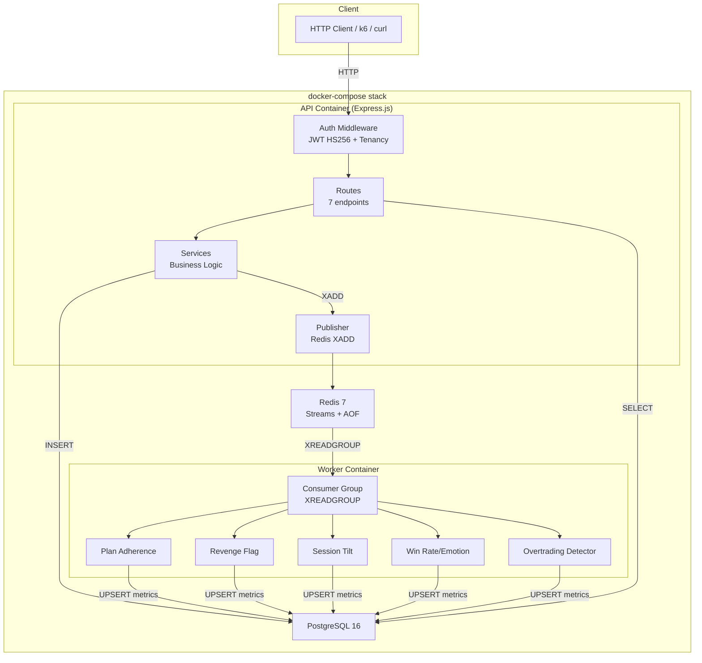

# NevUp Track 1 — Master Implementation Plan

> **Track**: System of Record — Backend Engineering  
> **Stack**: Node.js 20 + Express.js + PostgreSQL 16 + Redis 7  
> **Timeline**: 72 hours  
> **Companion docs**: [context.md](file:///C:/Users/harsh/.gemini/antigravity/brain/39b0720b-8b72-43ff-8cbd-2b5c3afe3298/context.md) · [task.md](file:///C:/Users/harsh/.gemini/antigravity/brain/39b0720b-8b72-43ff-8cbd-2b5c3afe3298/task.md) · [rules.md](file:///C:/Users/harsh/.gemini/antigravity/brain/39b0720b-8b72-43ff-8cbd-2b5c3afe3298/rules.md)

---

## Architecture Overview



---

## Tech Stack Decisions & Justifications

### Decision 1: Express.js over Fastify

| Factor | Express.js | Fastify |
|---|---|---|
| **Familiarity** | ✅ You have Express experience from paper-trading | ❌ New framework in a 72hr sprint |
| **Ecosystem** | ✅ Largest Node.js middleware ecosystem | 🟡 Growing but smaller |
| **Debugging** | ✅ Stack traces are well-known, tons of SO answers | 🟡 Less community debug knowledge |
| **Performance** | 🟡 Sufficient — Express handles 200 req/s easily with proper pooling | ✅ 2x faster raw throughput |
| **Hackathon risk** | ✅ Low — no learning curve | ❌ Higher — unfamiliar patterns |

**Verdict**: In a 72-hour sprint, familiarity > raw speed. Express can hit the p95 ≤ 150ms target with proper PG connection pooling and async patterns. The bottleneck will be PostgreSQL query time, not framework overhead.

### Decision 2: PostgreSQL 16 (No ORM)

**Why PG**: ACID compliance, `DECIMAL` precision for financial data, excellent indexing, you already have PG experience from paper-trading.

**Why no ORM**: The hackathon spec explicitly says *"No ORM hiding N+1s."* Raw SQL via `pg` (node-postgres) gives us:
- Full control over query plans
- Ability to include `EXPLAIN ANALYZE` output in DECISIONS.md
- No hidden N+1 queries
- Transparent performance characteristics

### Decision 3: Redis Streams over Kafka/RabbitMQ

| Factor | Redis Streams | Kafka | RabbitMQ |
|---|---|---|---|
| Docker complexity | 1 container | 3+ containers (ZooKeeper/KRaft + broker) | 1 container + management |
| At-least-once delivery | ✅ Consumer groups + XACK | ✅ | ✅ |
| Persistence | AOF enabled | Log segments | Durable queues |
| Learning curve | Low | High | Medium |
| Already useful for | Caching, rate limiting | Nothing else | Nothing else |

**Verdict**: Single container, consumer groups provide at-least-once delivery, AOF persistence survives restarts. Kafka is overkill for 388 trades; RabbitMQ adds operational complexity we don't need.

### Decision 4: Separate Worker Container

The worker runs as a **separate process** (`node src/workers/index.js`) in its own Docker container:
- Write path (API) is **never blocked** by metric computation
- Worker can be independently restarted without dropping API requests
- Clear separation of concerns in Docker logs
- Could be horizontally scaled (not needed for hackathon, but shows production thinking)

### Decision 5: Application-Layer Tenancy over PostgreSQL RLS

- **Application-layer check**: `if (jwt.sub !== userId) return 403`
- **PostgreSQL RLS**: `ALTER TABLE trades ENABLE ROW LEVEL SECURITY; CREATE POLICY ...`
- **Choice**: Application-layer — simpler, more explicit, easier to test and debug in 72 hours
- **DECISIONS.md note**: "RLS would be the production choice for defense-in-depth"

### Decision 6: morgan + pino-http for Structured Logging

Express doesn't have built-in structured logging like Fastify. We use:
- **`pino`** — Fast JSON logger, structured output
- **`pino-http`** — Express middleware that logs every request with latency, status, method, url
- **`crypto.randomUUID()`** — Generate traceId per request, attach to `req` and log context
- **`traceId` in error responses** — Spec requirement for end-to-end request tracing

### Decision 7: Seeding via Node.js Script (not SQL COPY)

The CSV uses camelCase columns (`tradeId`, `userId`, etc.) while our DB uses snake_case. Additionally, the JSON file has pre-computed session aggregates. A Node.js seed script:
- Reads the JSON file (richer data structure)
- Inserts sessions with pre-computed stats
- Inserts trades with proper column mapping
- Can validate data during insertion
- More reliable than `COPY` with column name mismatches

---

## Phase Breakdown

### Phase 1: Foundation (Hours 0–4)

**Goal**: Docker stack running, DB schema created, seed data loaded. `docker compose up` works.

#### Files to create:

| File | Purpose |
|---|---|
| `package.json` | Dependencies: `express`, `pg`, `ioredis`, `pino`, `pino-http`, `uuid`, `dotenv` |
| `.env.example` | Environment variable template |
| `Dockerfile` | Node 20 Alpine, `npm ci --production`, migration + server start |
| `docker-compose.yml` | 4 services: api, worker, postgres, redis |
| `migrations/001_create_trades.sql` | Trades table with outcome, pnl, revenge_flag |
| `migrations/002_create_sessions.sql` | Sessions table |
| `migrations/003_create_debriefs.sql` | Debriefs table |
| `migrations/004_create_metrics.sql` | All 5 metric tables |
| `src/migrate.js` | Runs migrations in order on startup |
| `src/seed.js` | Loads `nevup_seed_dataset.json`, inserts sessions + trades |
| `src/config.js` | Centralized env var access with defaults |

#### Design notes:
- Migrations are **plain SQL files** run sequentially by `src/migrate.js`
- The API container runs `node src/migrate.js && node src/seed.js && node src/server.js` on startup
- Worker container depends on API (ensuring DB is migrated before workers start)
- PostgreSQL healthcheck via `pg_isready`, Redis via `redis-cli ping`

---

### Phase 2: Auth + Core Middleware (Hours 4–8)

**Goal**: JWT verification, tenancy enforcement, traceId generation, structured logging — all working.

#### Files to create:

| File | Purpose |
|---|---|
| `src/server.js` | Express app bootstrap, middleware chain, route mounting |
| `src/middleware/auth.js` | JWT HS256 verify + `req.userId` extraction |
| `src/middleware/tenancy.js` | `req.userId === targetUserId` check → 403 |
| `src/middleware/traceId.js` | Generate UUID per request, attach to `req.traceId` |
| `src/middleware/errorHandler.js` | Global error handler with traceId in response |
| `src/utils/jwt.js` | `sign()` and `verify()` using `crypto.createHmac` |
| `src/utils/errors.js` | Standardized error response factory |
| `scripts/generate-token.js` | CLI tool to mint JWTs for testing |

#### Middleware chain order:
```
1. pino-http (logging)
2. traceId (attach UUID to req)
3. express.json() (body parsing)
4. auth (JWT verify — skipped for /health)
5. route handlers
6. errorHandler (catch-all)
```

#### Validation checklist (from jwt_format.md):
- [x] Verify HS256 signature with shared secret
- [x] Reject expired tokens (`exp < now`) → 401
- [x] Reject missing Authorization header → 401
- [x] Reject malformed tokens (bad base64, missing claims) → 401
- [x] Enforce `sub === userId` for data endpoints → 403
- [x] Include `traceId` in all error responses

---

### Phase 3: Write API — POST /trades (Hours 8–14)

**Goal**: Idempotent trade creation, Redis Stream publishing for closed trades.

#### Files to create:

| File | Purpose |
|---|---|
| `src/plugins/database.js` | `pg.Pool` singleton with connection config |
| `src/plugins/redis.js` | `ioredis` client singleton |
| `src/routes/trades.js` | `POST /trades` + `GET /trades/:tradeId` |
| `src/services/tradeService.js` | Insert logic, idempotency, P&L computation |
| `src/services/publisher.js` | `XADD trade:closed` for closed trades |

#### POST /trades — Flow:

```
1. Validate JWT → extract userId (auth middleware)
2. Validate request body against schema
3. Verify req.body.userId === req.userId (tenancy on write)
4. INSERT INTO trades ... ON CONFLICT (trade_id) DO NOTHING RETURNING *
5. IF rows returned → new trade
   a. If status === 'closed' → XADD to Redis Stream
   b. Return 200 with trade (spec says 200 for both new and existing)
6. IF no rows returned → SELECT existing record
   a. Return 200 with existing trade
7. NEVER return 409 or 500 for duplicates
```

> [!NOTE]
> The spec says both new and duplicate return **200**. The OpenAPI shows `200` as the only success response for `POST /trades`, described as "Trade created (or already exists — idempotent)". Some interpretations might use 201 for new, but we follow the spec literally.

#### GET /trades/:tradeId — Flow:
```
1. SELECT trade by trade_id
2. If not found → check if trade exists for another user
   a. If exists but different user → 403 (never 404 for cross-tenant)
   b. If truly not found → 404
3. Tenancy check: trade.user_id === req.userId → 403 if mismatch
4. Return 200 with trade
```

#### Computed fields on insert:
- `outcome`: if `status === 'closed'`, compute from direction + entry/exit price
- `pnl`: `(exitPrice - entryPrice) * quantity` for long, inverse for short
- `revenge_flag`: initially false, updated by worker

---

### Phase 4: Async Pipeline — Redis Streams + Workers (Hours 14–22)

**Goal**: All 5 behavioral metrics computed asynchronously for every closed trade.

#### Files to create:

| File | Purpose |
|---|---|
| `src/workers/index.js` | Worker process entry point, consumer group setup |
| `src/workers/planAdherence.js` | Rolling 10-trade average of planAdherence |
| `src/workers/revengeFlag.js` | 90-second window + anxious/fearful check |
| `src/workers/sessionTilt.js` | Loss-following ratio per session |
| `src/workers/winRateByEmotion.js` | Per-emotion win/loss/winRate |
| `src/workers/overtradingDetector.js` | 10 trades in 30 minutes |

#### Consumer Group Architecture:
```
Stream: "trade:closed"
Group: "metric-workers"
Consumer: "worker-1"

Loop:
  1. XREADGROUP GROUP metric-workers worker-1 COUNT 10 BLOCK 5000 STREAMS trade:closed >
  2. For each message:
     a. Parse trade data from message
     b. Run ALL 5 metric computations (sequential, not parallel — simpler error handling)
     c. Each metric reads context from PG, writes result back to PG
     d. XACK trade:closed metric-workers <messageId>
  3. On error: log error, DON'T XACK (message stays in PEL for retry)
```

#### Metric 1: Plan Adherence Score
```sql
SELECT plan_adherence FROM trades 
WHERE user_id = $1 AND status = 'closed' AND plan_adherence IS NOT NULL
ORDER BY exit_at DESC LIMIT 10;
-- Compute: AVG of returned values
-- Store: UPSERT into plan_adherence_scores (user_id, score, trade_count)
```

#### Metric 2: Revenge Trade Flag
```
For the newly closed trade:
  1. Was it a loss? (check outcome)
  2. Find trades by same user where entry_at is within 90 seconds after this trade's exit_at
  3. Are those subsequent trades in anxious/fearful emotional state?
  4. If YES → INSERT INTO revenge_trade_flags, UPDATE trades SET revenge_flag = true
```

#### Metric 3: Session Tilt Index
```
For the session of the closed trade:
  1. Get all closed trades in this session, ordered by exit_at
  2. Walk sequentially: if previous trade was a loss, current trade is "loss-following"
  3. tilt_index = loss_following_count / total_closed_count
  4. UPSERT into session_tilt_index
```

#### Metric 4: Win Rate by Emotional State
```
For the closed trade's emotional_state:
  1. Determine win/loss from outcome field
  2. UPSERT into win_rate_by_emotion:
     - INCREMENT wins or losses
     - RECALCULATE win_rate = wins / (wins + losses)
```

#### Metric 5: Overtrading Detector
```
For a newly entered trade:
  1. COUNT trades by same user in the last 30 minutes
  2. If count > 10 → INSERT into overtrading_events
```

---

### Phase 5: Read API — Sessions, Metrics, Health (Hours 22–30)

**Goal**: All remaining endpoints implemented and returning spec-compliant responses.

#### Files to create/modify:

| File | Purpose |
|---|---|
| `src/routes/sessions.js` | GET /sessions/:id, POST /sessions/:id/debrief, GET /sessions/:id/coaching |
| `src/routes/users.js` | GET /users/:id/metrics, GET /users/:id/profile |
| `src/routes/health.js` | GET /health (no auth) |
| `src/services/metricsService.js` | Query + aggregate metrics with timeseries bucketing |
| `src/services/sessionService.js` | Session summary with trades, debrief persistence |

#### GET /users/:userId/metrics — Response shape:
```json
{
  "userId": "uuid",
  "granularity": "daily",
  "from": "2025-01-01T00:00:00Z",
  "to": "2025-03-31T23:59:59Z",
  "planAdherenceScore": 3.2,
  "sessionTiltIndex": 0.35,
  "winRateByEmotionalState": {
    "calm": { "wins": 42, "losses": 18, "winRate": 0.7 },
    "anxious": { "wins": 5, "losses": 15, "winRate": 0.25 }
  },
  "revengeTrades": 7,
  "overtradingEvents": 3,
  "timeseries": [
    { "bucket": "2025-01-06T00:00:00Z", "tradeCount": 5, "winRate": 0.4, "pnl": 1779.11, "avgPlanAdherence": 2.4 },
    { "bucket": "2025-01-13T00:00:00Z", "tradeCount": 5, "winRate": 0.0, "pnl": -731.64, "avgPlanAdherence": 2.0 }
  ]
}
```

#### Timeseries bucketing by granularity:
- **`hourly`**: `date_trunc('hour', exit_at)` — one bucket per hour
- **`daily`**: `date_trunc('day', exit_at)` — one bucket per day
- **`rolling30d`**: `date_trunc('day', exit_at)` with 30-day sliding window aggregation

#### GET /sessions/:sessionId — Response shape:
```json
{
  "sessionId": "uuid",
  "userId": "uuid",
  "date": "2025-01-06T09:30:00Z",
  "notes": "string or null",
  "tradeCount": 5,
  "winRate": 0.4,
  "totalPnl": 1779.11,
  "trades": [ /* array of Trade objects */ ]
}
```

#### GET /sessions/:sessionId/coaching — SSE Stub:
```javascript
// Set headers for SSE
res.setHeader('Content-Type', 'text/event-stream');
res.setHeader('Cache-Control', 'no-cache');
res.setHeader('Connection', 'keep-alive');

// Stream tokens from a pre-built coaching message
const message = "You showed strong discipline in your first two trades...";
const tokens = message.split(' ');
for (const [i, token] of tokens.entries()) {
  res.write(`event: token\ndata: ${JSON.stringify({ token: (i > 0 ? ' ' : '') + token, index: i })}\n\n`);
  await sleep(50); // simulate streaming
}
res.write(`event: done\ndata: ${JSON.stringify({ fullMessage: message })}\n\n`);
res.end();
```

#### GET /health — Response shape (no auth):
```json
{
  "status": "ok",
  "dbConnection": "connected",
  "queueLag": 12,
  "timestamp": "2025-01-06T09:35:00Z"
}
```

---

### Phase 6: Testing (Hours 30–40)

**Goal**: Automated tests proving idempotency, auth, tenancy, and metric correctness.

#### Files to create:

| File | Purpose |
|---|---|
| `tests/trades.test.js` | Idempotency: POST same tradeId twice → same response |
| `tests/auth.test.js` | Expired token → 401, missing header → 401, cross-tenant → 403 |
| `tests/sessions.test.js` | Session summary correctness, debrief persistence |
| `tests/metrics.test.js` | Metric values match expected for seed data |
| `tests/integration.test.js` | Full flow: POST closed trade → wait → verify metrics updated |
| `tests/setup.js` | Test database setup, JWT generation helpers |

#### Test framework: `vitest` or Node.js built-in `node:test`

**Key test scenarios:**

| Test | What it proves | Expected result |
|---|---|---|
| POST same tradeId twice | Idempotency | Both return 200, identical body |
| POST with wrong userId in JWT | Tenancy on write | 403 |
| GET /users/B/metrics with JWT for User A | Tenancy on read | 403 |
| GET /trades/:id with expired JWT | Token expiry | 401 |
| GET /health with no JWT | Health is unauthenticated | 200 |
| Verify Alex Mercer's revenge flags | Metric correctness | 2 flags per session (trades 3&4) |
| Verify Jordan Lee's overtrading events | Metric correctness | Events in 30-min windows |

---

### Phase 7: Load Testing (Hours 40–48)

**Goal**: Prove p95 ≤ 150ms for 200 concurrent trade-close writes over 60 seconds.

#### Files to create:

| File | Purpose |
|---|---|
| `loadtest/k6-trade-close.js` | 200 VU script with unique trades |
| `loadtest/run.sh` | Dockerized k6 runner (reviewers don't need k6 installed) |
| `loadtest/results/` | HTML report output directory |

#### k6 script design:
```javascript
export const options = {
  vus: 200,
  duration: '60s',
  thresholds: {
    http_req_duration: ['p(95)<150'],  // p95 under 150ms
    http_req_failed: ['rate<0.01'],     // less than 1% failure
  },
};

export default function () {
  const tradeId = uuidv4();
  const payload = {
    tradeId,
    userId: TEST_USER_ID,
    sessionId: uuidv4(),
    asset: 'AAPL',
    assetClass: 'equity',
    direction: 'long',
    entryPrice: 178.45,
    exitPrice: 182.30,
    quantity: 10,
    entryAt: new Date().toISOString(),
    exitAt: new Date().toISOString(),
    status: 'closed',
    planAdherence: 4,
    emotionalState: 'calm',
    entryRationale: 'Load test trade',
  };
  
  const res = http.post(URL, JSON.stringify(payload), { headers });
  check(res, { 'status is 200': (r) => r.status === 200 });
}
```

#### Performance optimization checklist (if p95 > 150ms):
1. PG connection pool size: increase from default 10 → 20-30
2. Prepared statements for INSERT
3. Batch Redis XADD (unlikely to be bottleneck)
4. Ensure `trade_id` PRIMARY KEY index is being used
5. Check for table locks during concurrent inserts

---

### Phase 8: Polish + Deploy (Hours 48–72)

**Goal**: Documentation, deployment, final verification.

#### Files to create/modify:

| File | Purpose |
|---|---|
| `DECISIONS.md` | 7 design decisions with evidence |
| `README.md` | Setup instructions, API docs, architecture diagram |
| `.env.example` | All env vars documented |

#### DECISIONS.md outline:
1. Why Express.js over Fastify (familiarity, ecosystem, hackathon risk)
2. Why Redis Streams over Kafka (single container, sufficient guarantees)
3. Why raw SQL over ORM (spec mandate, query plan control)
4. Why 200 concurrent VUs (spec requirement, realistic peak)
5. Database indexing strategy (with `EXPLAIN ANALYZE` output)
6. Application-layer tenancy over RLS (simplicity vs defense-in-depth)
7. Worker as separate container (isolation, independent scaling)

#### Deployment options:
- **Railway**: `docker-compose` native support, easiest
- **DigitalOcean droplet ($6/mo)**: True docker-compose fidelity
- **Render**: You have experience, but no free Redis

---

## Time Budget Summary

| Phase | Hours | Cumulative | Deliverable |
|---|---|---|---|
| 1. Foundation | 4 | 4 | Docker stack + DB + seed data |
| 2. Auth + Middleware | 4 | 8 | JWT + tenancy + logging |
| 3. Write API | 6 | 14 | POST /trades + GET /trades/:id |
| 4. Async Pipeline | 8 | 22 | Redis Streams + 5 metric workers |
| 5. Read API | 8 | 30 | Sessions + Metrics + Health + Profile |
| 6. Testing | 10 | 40 | All automated tests passing |
| 7. Load Testing | 8 | 48 | k6 report showing p95 ≤ 150ms |
| 8. Polish + Deploy | 12 | 60 | DECISIONS.md + README + live URL |
| Buffer | 12 | 72 | Bug fixes, edge cases, documentation |

---

## Risk Registry

| Risk | Probability | Impact | Mitigation |
|---|---|---|---|
| p95 > 150ms under load | Medium | High | Pre-optimize PG pool, prepared statements, add indexes first |
| Redis Stream messages lost on crash | Low | Medium | AOF persistence enabled, consumer group PEL for retries |
| Seed data doesn't load correctly | Medium | High | Test seed script first, validate row counts |
| Docker build fails on deployment platform | Low | High | Test full `docker compose up` early and often |
| Metric computation is incorrect | Medium | High | Write unit tests against known seed data values |
| Clock issues with JWT expiry | Low | Low | Use UTC strictly, no clock skew tolerance |
